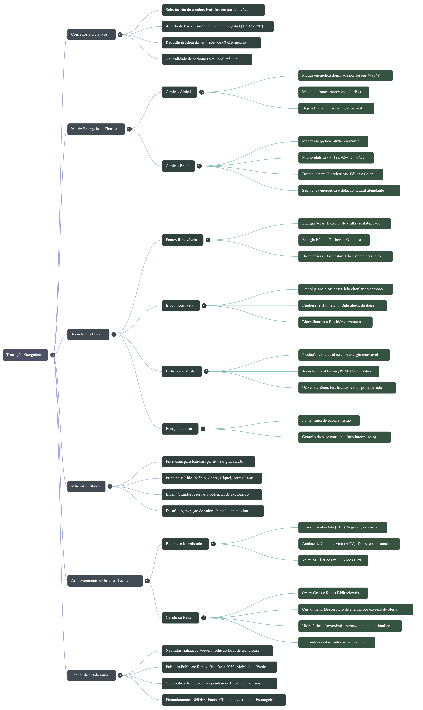

# 🧠 Treinando uma IA de Aprendizagem com NotebookLM

### Bootcamp Bradesco - GenAI, Dados & Cyber

---

## 📌 Visão geral do projeto

Este projeto foi desenvolvido no contexto do Bootcamp Bradesco - GenAI, Dados & Cyber, com foco na exploração prática do NotebookLM como ferramenta de aprendizagem assistida por inteligência artificial.

A proposta consiste em construir um **caderno temático estruturado**, combinando curadoria de fontes, engenharia de prompts e organização de conhecimento, utilizando IA generativa para apoiar o processo de estudo e síntese de informações.

---

## 🎯 Objetivos

* Explorar o uso do NotebookLM como ferramenta de apoio ao aprendizado
* Realizar curadoria de fontes abertas relevantes sobre um tema específico
* Desenvolver e testar estratégias de engenharia de prompts
* Documentar o processo de interação com a IA (incluindo tentativas, ajustes e melhorias)
* Consolidar o conhecimento em um miniguia estruturado de estudo

---

## 📚 Estrutura do repositório

## 📁 Estrutura do projeto

```text
📁 docs/
 ├── fontes.md         # Curadoria de referências utilizadas
 ├── prompts.md        # Registro de engenharia de prompts
 ├── notebook.md       # Síntese final do aprendizado
 └── conclusao.md      # Dificuldades, ajustes e insights

📁 assets/
 ├── mapa-mental.png   # Representação visual do tema
```

---

## 🧠 Materiais do projeto

### 🗺️ Mapa mental

Representação visual dos principais conceitos explorados no caderno temático.



---

## ⚙️ Metodologia

O desenvolvimento do projeto seguiu as seguintes etapas:

1. Definição do tema de estudo  
2. Seleção de fontes confiáveis e abertas  
3. Inserção de conteúdos no NotebookLM  
4. Experimentação com diferentes prompts  
5. Refinamento das respostas geradas pela IA  
6. Organização do material final em formato estruturado  

---

## 🧪 Engenharia de prompts

Durante o processo, foram testadas diferentes abordagens de interação com a IA, incluindo:

- Ajustes de contexto e detalhamento dos prompts  
- Reformulação de perguntas para maior precisão  
- Iteração com base em respostas incompletas ou genéricas  
- Registro de falhas e melhorias aplicadas  

---

## 🧩 Aprendizados

Este projeto permitiu desenvolver uma visão mais crítica sobre o uso de IA generativa como ferramenta de estudo, especialmente no que diz respeito a:

- Importância da qualidade das fontes  
- Impacto da formulação dos prompts na resposta da IA  
- Necessidade de iteração e refinamento contínuo  
- Organização do conhecimento como parte essencial do aprendizado  

---

## 🚀 Desfecho

O NotebookLM se mostrou uma ferramenta poderosa para estruturar conhecimento, mas seu valor depende diretamente da curadoria de conteúdo e da qualidade da interação do usuário com a IA.

Este projeto demonstra não apenas o uso da ferramenta, mas também o processo de construção do conhecimento mediado por inteligência artificial.

---

## 👩‍💻 Autoria

Projeto desenvolvido como parte do Bootcamp Bradesco - GenAI, Dados & Cyber.
